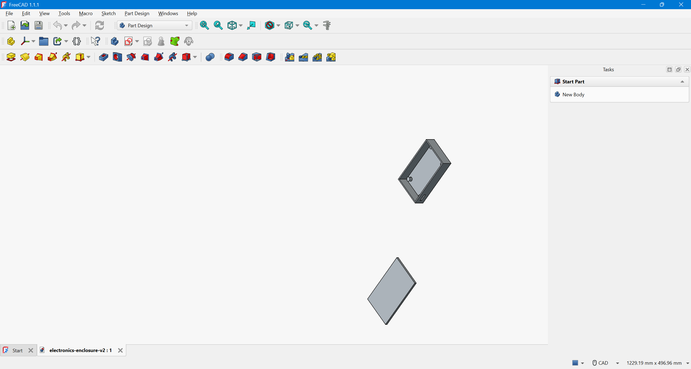
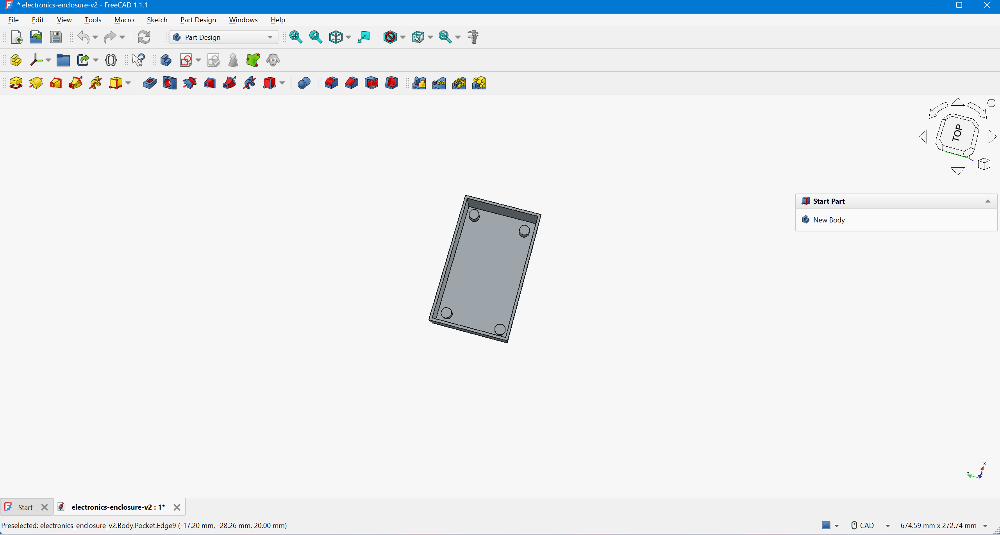

# electronics-enclosure-v2
Beginner-to-intermediate FreeCAD project: two-piece electronics enclosure with hollow base, PCB standoffs, vent cutout, and separate lid.
# Electronics Enclosure Design — FreeCAD CAD Project

## Overview

This project is a beginner-to-intermediate FreeCAD design of a two-piece electronics enclosure. The model includes a hollow base, PCB mounting standoffs, a front ventilation cutout, and a separate lid/top cover.

The goal of this project was to practice practical CAD modeling skills by creating a small enclosure that could represent a housing for a circuit board or electronics prototype.

## Project Features

- Two-piece enclosure design
- Hollow base with 2 mm wall thickness
- Four internal PCB mounting standoffs
- Front ventilation cutout
- Separate lid/top cover
- Parametric modeling workflow in FreeCAD
- CAD file prepared for portfolio documentation

## Tools Used

- FreeCAD
- Part Design Workbench
- Sketcher Workbench
- GitHub for documentation and version control

## Design Dimensions

| Component | Dimension |
|---|---:|
| Base length | 100 mm |
| Base width | 60 mm |
| Base height | 20 mm |
| Wall thickness | 2 mm |
| Standoff diameter | 8 mm |
| Standoff height | 6 mm |
| Lid size | 104 mm x 64 mm |
| Lid thickness | 4 mm |
| Vent cutout | 15 mm x 3 mm |

## Screenshots

### Exploded View

### Base Detail View

## Skills Demonstrated

- Creating constrained sketches
- Using pad and pocket operations
- Applying wall thickness to create a hollow part
- Creating internal mounting features
- Designing separate CAD bodies
- Preparing a CAD project for GitHub portfolio presentation

## Skill Level

Beginner-to-intermediate CAD project.

This project is not intended to represent expert-level mechanical design. It demonstrates hands-on FreeCAD practice, basic enclosure modeling, part documentation, and iterative design improvement.

## Notes

This project was created as a portfolio piece to demonstrate practical CAD learning and basic digital asset creation. Future improvements could include screw holes, lid fastening features, rounded edges, additional ventilation patterns, and exported STEP/STL files.
